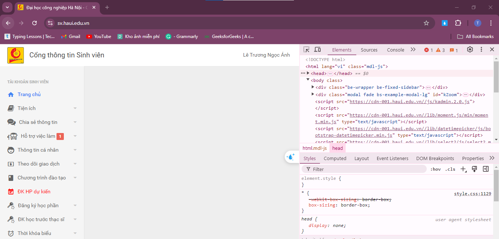
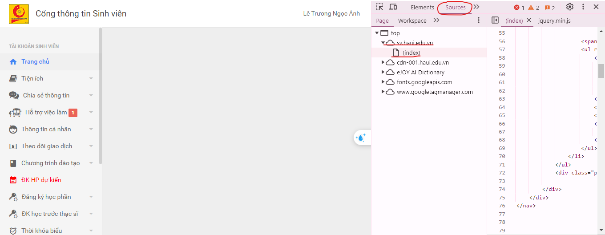
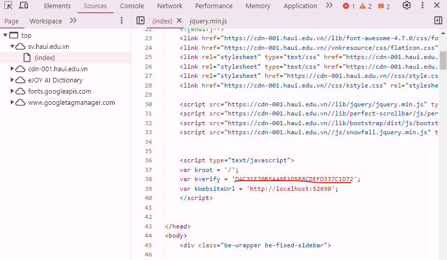
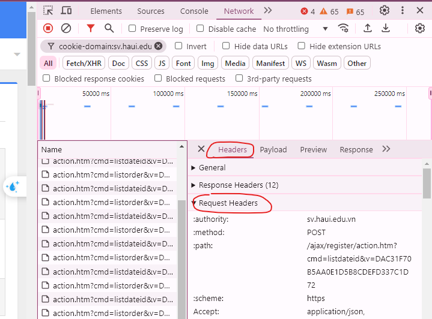
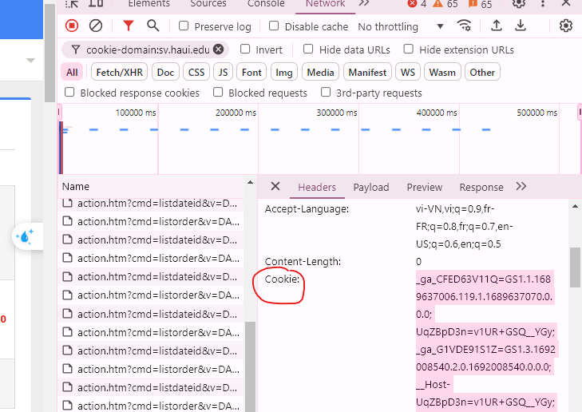

# Tên Dự Án

<strong>zPyHaui</strong>


## Giới Thiệu

Học hành đã áp lực rồi ..... mà lại còn phải đi dành nhau từng chỗ ngồi nữa ~.~

Một dự án nho nhỏ góp phần giúp bạn có những phút giây đăng kí môn học nhẹ nhàng hơn.

## Cài Đặt

<h2> Cách để lấy kverify của mình (Làm theo ảnh nha) </h2>

Bước 1:

Sau khi vào trang chủ thì ta ấn F12 hoặc click chuột phải vào màn hình chọn inspect (Kiểm tra)



Bước 2:

Kế đến chúng ta chọn Sources -> sv.haui.edu.vn -> (index) như hình:



Bước 3:

Trong mục index kéo xuống và tìm kverify ở phần <'script'>



<h2> Cách để lấy cookie </h2>

Bước 1:

Đăng nhập vào phần đăng kí học phần trước 30p nha, nhớ mở phần kiểm tra trước khi vào đăng kí học phần nha ^^

Chuyển đến Network rồi chọn bất kì mục action.html..... nào ở dưới cũng được nha


Bước 2:

ở bên cạnh chọn Header rồi tìm đến mục Request Headers



Bước 3:

Kéo xuống dưới tìm mục Cookie rồi coppy hết các giá trị của nó bên cạnh là xong (Sẽ khá là dài đấy) ^^



```bash

git clone https://github.com/ductrung309/sub_register-haui

```
